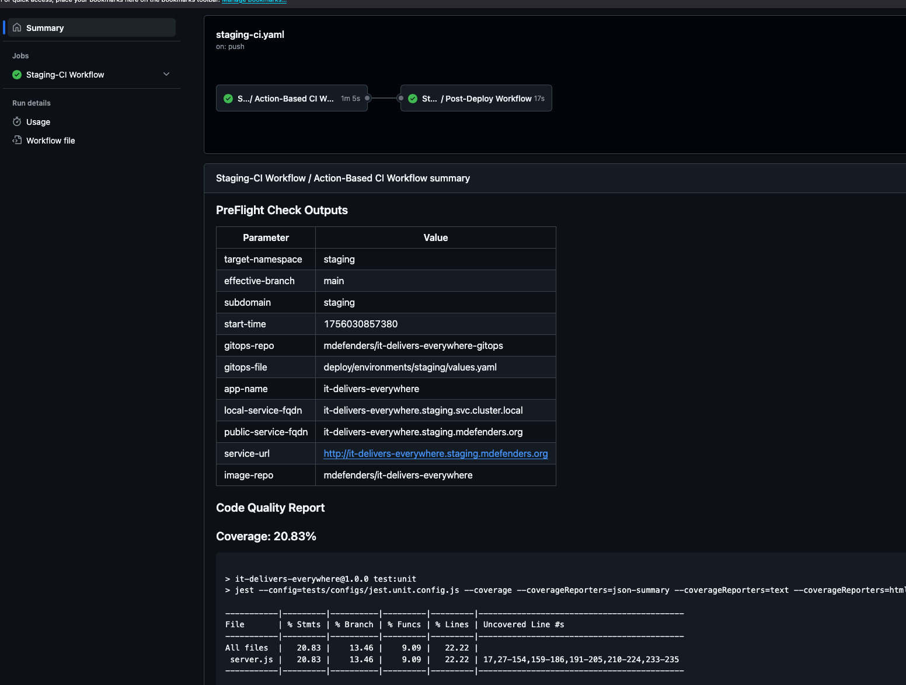
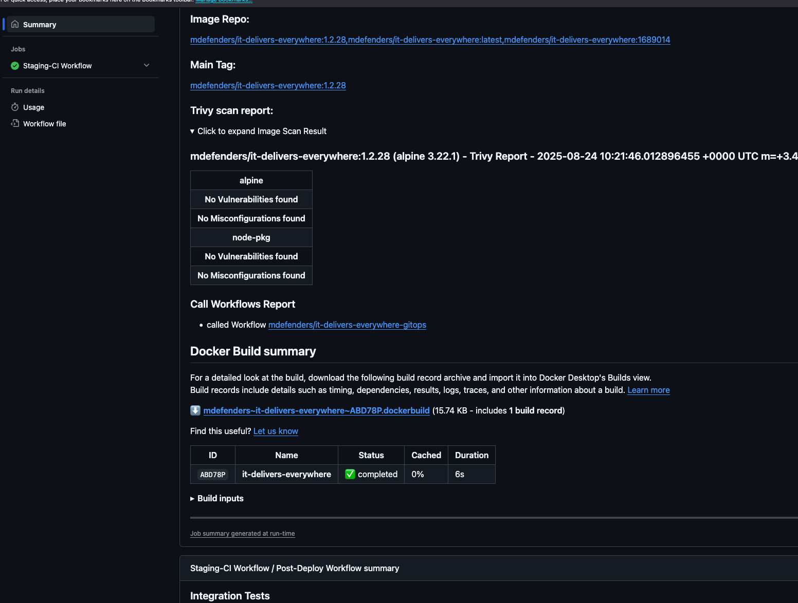
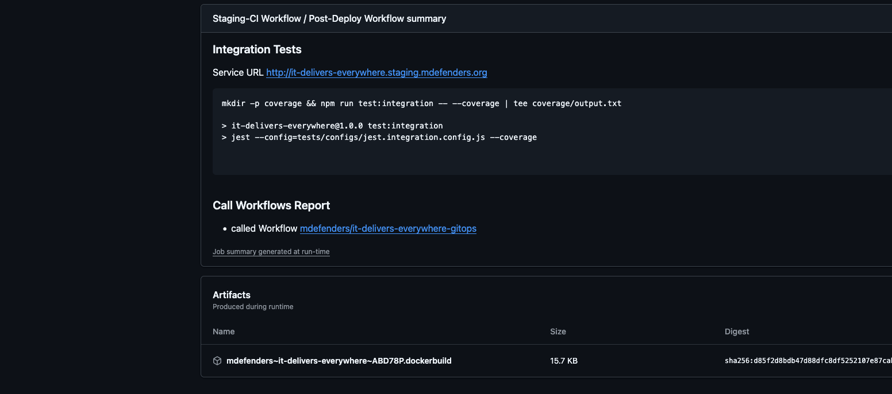
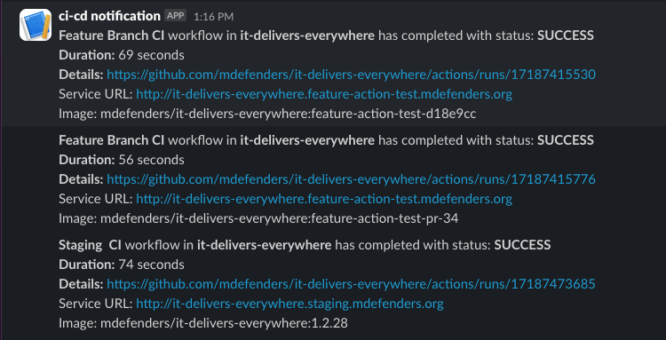

# Brief Developer Onboarding Guide

The CI/CD has been developed with the goal of making your work easier and more productive.  
Feel free to reach out to the team and share your ideas for improvements.

This is v2 release candidate, created as an improved and simplified version of
[Some testing assigment](https://github.com/mdefenders/it-delivers-everywhere/)

**Key changes include:**

- Moving from GitFlow to GitHub Flow
- Parallel feature branch development with namespace isolation fully automated with ArgoCD ApplicationSets
- Only three environments: `dev`, `staging`, and `production`
- No manual release branch creation. Major, minor versions are controlled by the source code with CI auto-incrementing
- Cost saving feature may be activated on `dev`, `staging` to descale deployments after tests are completed

## Overview

The flow is based on [GitHub Flow](https://docs.github.com/en/get-started/using-github/github-flow) and GitOps
principles, using GitHub Actions for CI and ArgoCD for CD.  
In most cases, your only interface will be the [GitHub UI](https://github.com/mdefenders/it-delivers-everywhere/).

GitHub Actions workflow files are located in the `.github/workflows` directory. Each file defines an
environment-specific pipeline that combines a tailored set of reusable workflows.


> **IMPORTANT:** All [reusable workflows](https://github.com/mdefenders/shared-workflows) are stored in a separate
> repository.

## Promote Your Code from Feature Branch to Production

**Create a feature branch** from `develop` (e.g., `feature/my-awesome-feature`), make your changes, commit, and push.

OR
**Create a Pull Request (PR)** to the `master` branch.

> Code quality checks, unit tests, Docker image build and push to DockerHub, image security scan, deployment to the
`dev` Kubernetes environment, regression and integration tests.  
> You'll receive a deployment notification with links to the workflow run report and the deployed service URL.

**Merge a Pull Request (PR)** to the `master` branch.
> Code quality checks, unit tests, Docker image build and push to DockerHub, image security scan, deployment to the
`staging` Kubernetes environment, Final end-to-end testing is performed. On tests success CD tags the repository with a
> release version tag
> You'll receive a deployment notification with links to the workflow run report and the deployed service URL.

**Trigger production deployment** by manually running
the [GitHub Actions workflow](https://github.com/mdefenders/it-delivers-everywhere/actions/workflows/prod-cd.yaml) on
the `main` branch.

> The service is deployed to the `production` environment using **ArgoCD**.  
> During the pre-deployment step, the CD pipeline verifies:
> - `version.json` contains a valid [Semantic Versioning](https://semver.org/) (SemVer) version
> - The repository is tagged with this version, confirming successful end-to-end testing in staging
> - The corresponding Docker image is available in **DockerHub**
> - After deployment, **smoke tests** validate that the service is running and responsive.  
> If the smoke tests fail, the deployment is automatically rolled back by restoring the previous image tag in the GitOps
> manifest.

## Add Tests

Inside the `tests` folder, you'll find subfolders for organizing your unit, integration, end-to-end, and smoke tests.  
Currently, a simple unit test is provided as a placeholder.

The CI/CD pipeline automatically runs the appropriate tests during each promotion stage.  
For integration tests, service URLs are provided via environment variables.  
At the moment, only the current service's URL is available through the `$SERVICE_URL` environment variable.

| Folder        | Triggered At Stage |
|---------------|--------------------|
| `unit`        | All stages         |
| `integration` | Dev                |
| `endtoend`    | Staging            |
| `smoke`       | Production         |

## Workflow Run Report

You can access the workflow run directly through the **Actions** tab in the GitHub repository, or via a direct link
included in the post-deployment notification.

The report includes:

- A visual workflow jobs graph showing each pipeline step and its status
- Test results
- A link to the built Docker image in DockerHub
- Image vulnerability scan report (**folded by default** to reduce noise)
- GitOps deployment manifests changes with commit references
- Direct links to build errors (if any)
- A direct link to the deployed service

[Example](https://github.com/mdefenders/it-delivers-everywhere/actions/runs/16678359527) of the workflow run report
> Only collaborators with write access (or higher) can view them in the GitHub UI.




## Notifications



> The most critical notification is that the service has passed tests and was successfully deployed to the target
> environment — this is already implemented wit Slack.
> For failures, we currently rely on GitHub’s default email notifications. This approach is sufficient for the scope of
> the testing assignment, but in a real-world scenario, more robust alerting would be appropriate. For example:

- Sophisticated Custom Slack notifications can be added for specific events such as test failures or deployment errors.
- Email-to-Slack forwarding can be configured via your email provider to centralize alerts.

> Read the TL;DR below or reach out to us for more details.

## Monitoring & Observability

A high-level overview of pipeline runs and deployments is available through
the [Grafana Cloud Dashboard](https://aditor.grafana.net/public-dashboards/aaa5de30a41e40a7a0a2400d7c40f8f1/) (free
tier).

Only essential metrics are collected to provide quick insights into:

- What succeeded
- What failed
- How long each stage took

To drill down into specific runs, simply click on the corresponding link in the dashboard — it will take you directly to
the detailed GitHub Actions workflow execution.



# TL;DR

## Goals

- Deploy the service as part of a larger microservices-based solution
- Achieve **zero-click** deployment automation
- Build a comprehensive CI/CD pipeline with automated testing and code quality gates
- Enable reliable production deployment with built-in rollback capabilities

## Intentionally Out of Scope

The following features, while important in real-world scenarios, were intentionally excluded for simplicity or
time-saving reasons.  
However, the current design allows for their implementation in the future if needed:

- **Blue/Green or Canary deployments.**  
  Standard Kubernetes rollout strategies are sufficient for this service's reliability needs.
- **Kubernetes infrastructure provisioning as IaaC.**
- **Cross-service integration** in end-to-end tests during release deployments.
- **Automated onboarding of new services.**
- **Promotion flow automation.**
- **Pinning reusable workflows** to tagged versions (`@vX`) instead of using the `dev` reference.
- **Job failures** Security vulnerabilities haven't been fixed to demonstrate job reporting and failures handling.
- **on_create** triggers intentionally not implemented because of the service behavior.

> In a real word scenario, a wrapper action may be created to route on create calls proper way.

- **Reusable workflows** with embedded Bash scripts were used for logic isolation and reuse due to:

    - The lack of suitable, trustworthy community GitHub Actions that fit the required use cases
    - The overhead of creating fully-fledged custom Actions was out of scope for this testing assignment

> **Real-world recommendation:** For production-grade pipelines, it's recommended to implement custom GitHub Actions
> with proper testing suites and documentation. This helps reduce the number of jobs, improves maintainability, and
> reserves separate jobs mainly for true parallelism or environment-specific logic.

- No detailed log shipping per job was implemented.

> **Real-world recommendation:** It's valuable to centralize job-level logs and error details in a monitoring system.  
> This enables faster root cause analysis by providing visibility into which specific steps or commands caused a
> failure.

## Architecture & Design

### Deployment Platform

The service is deployed as a **Kubernetes Deployment**, leveraging Kubernetes' native capabilities for scalability,
reliability, and observability.

- **Stateless** by design
- **Deployed using Helm** (a basic chart is included locally for demo purposes)
- **GitOps-driven** rollout (compatible with tools like ArgoCD or FluxCD)

Although the Helm chart, ArgoCD ApplicationSets and Applications are included in this repository for demonstration
purposes, in production we recommend using a centralized Helm chart registry to ensure consistency and reusability.

> The included Helm chart is intentionally minimal and serves to demonstrate CD-related functionality only.  
> It creates a Kubernetes Deployment with liveness/readiness probes, but omits Ingress and Service resources, which are
> not required for this demo.

### CI/CD & Promotion Flow

The service follows a GitFlow based promotion model:

```ascii
    +-------------+        Push        +------------------+
    | Developer   |------------------->|  feature/*       |
    +-------------+                    +------------------+
                                           | Unit tests 
                                           | Build/push                                           
                                           | Dev deploy
                                           v Regression/Integration
                                             tests
     Open PR into                     +------------------+
     main                             |      main        |
                                      +------------------+
                                           | Unit tests 
                                           | Build/push                                           
                                           | Dev deploy
                                           v Regression/Integration
                                             tests
     Merge PR into                     +------------------+
     main                              |      main        |
                                       +------------------+
                                           | Build/push
                                           | Staging deploy
                                           v End-to-End tests
     Prod depoy trigger                +------------------+
                                       |      main        |
                                       +------------------+
                                           | Tagging,
                                           | Production deploy
                                           v Smoke-tests                                           
                                      GitOps/CD system
                                      updates cluster
```

This flow should be secured with branch protection rules to prevent direct pushes to develop, release/*, and main —
allowing only changes made through Pull Requests or by the GitHub Actions user.

## CI/CD Pipeline Logic

### GitHub Actions (CI)

Reusable workflows were created for each branch and code promotion step to ensure logical separation, code reuse, and
make the CI/CD process easier to maintain and more reliable.

Most workflow steps and components are also implemented as reusable workflows using Bash scripts, specifically for the
testing assignment. In a real-world scenario, it is recommended to implement custom GitHub Actions with proper testing
and packaging to improve maintainability and reduce job runs.

The CI pipeline, implemented with GitHub Actions, performs the following steps:

- Code quality checks: linting, unit tests, and coverage threshold enforcement
- Docker image build
- Push the built image to the container registry
- Update GitOps deployment manifests based on the target environment (determined by branch naming logic)
- Run integration tests (if applicable at the current stage)

### GitOps-Based CD

The CD flow relies on GitOps principles:

- Git is the **single source of truth** for deployment configuration
- ArgoCD watches the GitOps repository and syncs the declared state with the cluster
- ApplicationSets used to automatically create ArgoCD Applications for each feature branch, ensuring that each service
  has its own namespace and deployment configuration
- Deployment is executed using native Kubernetes `Deployment` resources

> Kubernetes handles delivery safely using native rollout strategies like rolling updates, readiness probes, and health
> checks.

## Repository & Branching Strategy

### Repository Layout

This project uses a **composite repository** (monolith-per-service), which includes:

- Application source code
- Helm chart (for demo purposes — in production, use a centralized chart registry)
- GitOps deployment manifests

> **Why this structure?**  
> A repository that combines both the service code and its GitOps configuration:
> - Simplifies CI/CD pipelines by enabling build and deploy in a single pipeline run
> - Avoid build queuing and merge conflicts in GitOps manifests during parallel service builds
>
> In real-world projects, either a **pure monorepo** or **split-repo** (multi-repo) structure may be more appropriate,
> depending on team size, service scale, and system complexity.

### Branching Model

The project follows the **GitHub Flow** model:

- `feature/*` — Feature development
- `main` — Production-ready releases (Production deployment)

## Versioning Strategy

This project employs a hybrid versioning scheme that leverages Git commit identifiers and Semantic Versioning (SemVer),
applied according to the deployment stage:

- **Dev builds:** use short commit SHA1 tags (e.g., `{.branch}-<sha>`) for feature pushes and `{.branch}-PR-<.prNumber>`
  for PRs
- **Releases:** follow Semantic Versioning (MAJOR.MINOR.PATCH) for all merges to master.
  The major and minor versions are derived from the source code (`version.json`), while the patch version is
  automatically incremented by the CI/CD pipeline based on commit metadata (e.g., type or labels). The resulting version
  is written back to `version.json`in the repository.

### Build and Version Traceability

At all stages, version information is available via:

- Docker image tags
- Kubernetes pod labels
- Health check endpoints (`/health`)
- GitHub Actions workflow run reports (including direct links to the DockerHub images)

For production deployments, a `version tag` is added to the Git repository on the deployment commit.

> **Why this approach?**
> - Using SHA1 tags for dev builds avoids cluttering the repository with transient build tags while maintaining
    traceability
> - Using `version` in `version.json`/`package.json` for releases aligns with standard npm and SemVer conventions widely
    used in the Node.js ecosystem

## Code Quality Gates

Code Quality Gates are enforced through GitHub Actions workflows, triggered on every push and checked on key branches
and PRs.

> For this testing assignment repository, **branch protection rules are intentionally NOT enabled** to allow
> demonstration of possible failures and to simplify access configuration for action runners.  
> In production, direct merges to these branches should be disabled to strictly enforce Code Quality Gates.

The strategy balances development speed and quality by applying lighter restrictions during early development and
progressively increasing enforcement as code moves through higher environments.

The quality gates include:

- Linting (ESLint or equivalent)
- Code formatting checks
- Dependency security audits
- Unit and integration tests
- Test coverage thresholds
- Docker image vulnerability scanning

> In a real-world scenario, extended code security checks (e.g., static analysis, dependency scanning) can be integrated
> immediately after unit testing. However, for the purposes of this testing assignment, scanning the final container
> image
> is considered sufficient.

## Rollback Strategy

Kubernetes Deployments are configured to ensure safe and reliable rollbacks using:

- **Rolling updates** (default Kubernetes strategy)
- **Readiness and liveness probes** to validate pod health
- **Automatic rollback on failure** triggered by post-deployment smoke tests
- Manual rollback by reverting the GitOps image tag to a previous known-good version

## Secrets & Configuration

Secrets and environment-specific configurations are **not hardcoded**. Instead, they are managed through:

- GitHub Actions Secrets for CI/CD workflows
- Kubernetes Secrets for deployed infrastructure and applications (optionally integrated with Vault Operator or similar
  solutions) - **NOT** implemented, but assumed to be used in production

## Source Code Improvements/Changes

### Dockerfile

```Dockerfile
COPY package*.json ./
RUN npm ci --only=production

COPY server.js .
```

- Added `package-lock.json` to ensure consistent dependencies
- Used `npm ci` for production builds to guarantee a clean installation of dependencies
- Added `COPY server.js .` to copy the main application file into the image, preventing accidental inclusion of
  unnecessary files

### Dependencies

Dependabot is enabled in the repository to keep dependencies up to date safely and automatically.

### Tests

A very basic unit test is included as a placeholder for all types of tests that may be added later.

### Health Checks

- Added basic HTTP health checks (`/health`) in the Kubernetes Deployment to verify the service is running and
  responsive
- The `/health` endpoint returns the deployed build version and commit hash
- The Deployment is configured with a **RollingUpdate** strategy to ensure safe, zero-downtime upgrades

> **Security note:** If there are security concerns, access to the `/health` endpoint should be properly secured.

## Testing Strategy

The testing strategy is based on the following principles:

- **Unit tests**: Run on every code push
- **Regression / Integration tests**: Run after deploying `feature` builds to the development environment
- **End-to-end tests**: Run after deploying `main` builds to the staging environment
- **Smoke tests**: Run after production deployment to ensure the service is responsive — failure triggers an automatic
  rollback

> The most challenging aspect of this strategy is reliably triggering integration, end-to-end, and smoke tests **after**
> deployment rollouts.  
> The most robust approach is to configure the CI/CD pipeline to query the Kubernetes or ArgoCD API to verify that the
> rollout has completed and the service is live before running tests.

> However, in this context, the CI/CD pipeline **cannot access the Kubernetes API**, so alternative solutions were
> explored.

> One considered approach was pushing deployment status metrics from the running service to an external endpoint, such
> as **Grafana Cloud (free tier)**.  
> This was ultimately rejected due to concerns over reusability, reliability, and manual overhead.

> The chosen solution mocks Kubernetes API/CLI calls to simulate a successful rollout, allowing tests to proceed as if
> the deployment had completed.

> In a real-world scenario, the `kubectl` CLI should be replaced with a **custom GitHub Action** that makes
> authenticated Kubernetes API calls for robust rollout verification.

## GitHub Organization/Repo configuration

> **IMPORTANT:** Create your orgs repos with DockerHub K8S safe names as:
>- direct name mapping used
>- no automatic name conversion until transition from Bash to GitHub Actions TypeScript

Set develop branch as the default branch
Workflows configured to use standard GitHub Hosted Runners
Configure the following secrets and variables on Organization or repository level:

### Secrets

| Value                | Description                                                | 
|----------------------|------------------------------------------------------------|
| `CICD_SLACK_WEBHOOK` | Full Slack Channel URL with tokens, provided by Slack      |
| `DOCKER_PASSWORD`    | DockerHub API Token                                        |
| `PROM_PUSH_TOKEN`    | Grafana Cloud base64 encoded username:token for Basic Auth |

### Variables

| Name                   | Description                                                      | Default Value |
|------------------------|------------------------------------------------------------------|--------------:|
| DEPLOY_FORCE_RUN_TESTS | Force tests to run even if the deployment is not fully available |       `false` |
| DEPLOY_PULL_COUNT      | Number of attempts to check deployment readiness                 |          `10` |
| DEPLOY_PULL_INTERVAL   | Delay (in seconds) between deployment readiness checks           |          `20` |
| DOCKER_USERNAME        | DockerHub username used for image publishing                     |               |
| MIN_COVERAGE           | Minimum required test coverage percentage                        |          `80` |
| NOTIFY_DEPLOY_SUCCESS  | Enable notifications on successful deployment                    |        `true` |
| PUSH_FB_IMAGE          | Push Docker image for feature branch builds to DockerHub         |       `false` |
| TRIVY_VERSION          | Version of Trivy used for container image vulnerability scanning |               |
| LOKI_PUSH_URL          | Grafana Cloud Loki push full URL                                 |               |
| DEV_REPLICAS           | Development environment pods deployed after CI/CD run            |           `0` |
| STAGING_REPLICAS       | Staging environment pods deployed after CI/CD run                |           `0` |
| DEV_TEST_REPLICAS      | Development environment pods deployed for automated tests        |           `3` |
| STAGING_TEST_REPLICAS  | Staging environment pods deployed for automated tests            |           `3` |

## Local Kubernetes Deployment

You can test the deployment locally by following these steps:

- Install a local Kubernetes cluster
    - Enable Kubernetes in Docker Desktop
    - Or use Minikube: [https://minikube.sigs.k8s.io/](https://minikube.sigs.k8s.io/)
- [Install ArgoCD](https://argo-cd.readthedocs.io/en/stable/getting_started/)
- Update the `deploy/arfocd/github-token` file with GitHub token
- Update the `deploy/argicd/appset.yaml` file with your GitHub organization name
- Deploy ArgoCD ApplicationSet and Application manifests:

```bash
kubectl apply deploy/argocd/github-token.yaml
kubectl apply -f deploy/argocd/appset.yaml

kubectl get appsets
NAME                              AGE
it-delivers-everywhere-features   13h

kubectl get apps
NAME                                     SYNC STATUS   HEALTH STATUS
it-delivers-everywhere-feature-ver-1.2   Synced        Healthy

kubectl get ns
NAME                                     STATUS   AGE
argocd                                   Active   24h
default                                  Active   10d
dev                                      Active   23h
it-delivers-everywhere-feature-ver-1-2   Active   3h11m
kube-node-lease                          Active   10d
kube-public                              Active   10d
kube-system                              Active   10d

kubectl get po -n it-delivers-everywhere-feature-ver-1-2
NAME                                      READY   STATUS    RESTARTS   AGE
it-delivers-everywhere-6dfccf6f76-tbjp6   1/1     Running   0          41m
```

- Use `kubectl port-forward` to access the service locally:

```bash
kubectl port-forward it-delivers-everywhere-6dfccf6f76-tbjp6 3000:3000 -n it-delivers-everywhere-feature-ver-1-2
curl -ks localhost:3000/health | jq
{
  "status": "ok",
  "version": "SNAPSHOT",
  "commit": "f954d61"
}
```

- The Kubernetes Deployment includes a label with the image tag, enabling traceability from the deployed pod back to the
  specific container image version.

```bash
kubectl get pods -ltag=VER-1.2-f954d61 -n it-delivers-everywhere-feature-ver-1-2
NAME                                      READY   STATUS    RESTARTS   AGE
it-delivers-everywhere-6dfccf6f76-tbjp6   1/1     Running   0          46m

kubectl get pods --show-labels -n it-delivers-everywhere-feature-ver-1-2
NAME                                      READY   STATUS    RESTARTS   AGE   LABELS
it-delivers-everywhere-6dfccf6f76-tbjp6   1/1     Running   0          45m   app=it-delivers-everywhere,pod-template-hash=6dfccf6f76,tag=VER-1.2-f954d61
```

## Design Flaws and Required Refactoring

### Monorepo

The decision to combine the GitOps repository with the service code—aimed at enabling build and deployment within a
single pipeline run without relying on GitHub API calls (to keep the testing assignment lightweight) — introduced
several issues:

- Merges must be avoided during pipeline execution.
- Release tags are applied to GitOps commits rather than merge commits, reducing traceability and making it harder to
  track actual code changes.
- PR builds: add a GitOps deployment commit that skips GitHub Actions workflow checks and prevents automatic mapping to
  PR status checks.

> **Real-world recommendation:** Split GitOps and service code into separate repositories for better separation of
> concerns and cleaner workflows.

### Monitoring and Observability

To improve log parsing and analysis in Grafana Cloud, the log format should be switched from plain text to structured
JSON. This change is best implemented after migrating from Bash to a more JSON-friendly scripting or programming
language.

Additionally, long-running job alerting should be introduced to ensure that any unusually long executions are detected
and properly addressed in real time.

## Summary

This project presents a practical example of a modern CI/CD pipeline tailored for microservices, featuring:

- GitHub Actions for continuous integration seamlessly integrated with GitOps-driven continuous deployment using ArgoCD.
- A realistic branching and promotion strategy inspired by GitHub Flow, focusing on development agility.
- A clear and consistent versioning scheme combining Git commit hashes and Semantic Versioning to ensure traceability
  across all environments.
- Kubernetes-native deployment patterns leveraging rolling updates, readiness and liveness probes, and automated
  rollback for reliable releases.
- Well-defined separation between development, staging, pre-production, and production environments to support thorough
  testing at every stage.
- Modular and extensible architecture that can be scaled or adapted to more complex microservice platforms.

Although simplified for this testing assignment, the solution is designed to be production-aware and easily extendable,
offering a solid foundation for building robust and automated delivery pipelines in real-world projects.

## After-party Backlog

- [X] Create Grafana dashboards for monitoring and alerting
- [ ] Add skip ci/cd commit message.
- [ ] Remove feature/* name convention.
- [ ] Replace Bash scripts in the pipeline with custom or community-supported GitHub Actions for better maintainability
- [ ] Integrate the K8S service into the Helm chart to simplify local testing and deployment
- [ ] Replace hardcoded values with GitHub Actions variables for improved flexibility
- [ ] Enable branch protection rules on key branches and configure GitHub Actions with the necessary permissions to push
  to protected branches
- [ ] Add manual triggers for staging end-to-end test executions
- [ ] Automate updating the service version in `package.json` during release branch creation
- [ ] Add DependaBot PR to FeatureBranch Workflow filters
- [X] Add cost saving undeploy on success and undeploy on failure options
- [X] Move from GitFlow to Branch-per-release or Trunk-based development# it-delivers-everywhere
- [ ] Add safe name conversions from GitHub org/repo names to Docker image names nad K8S namespaces
